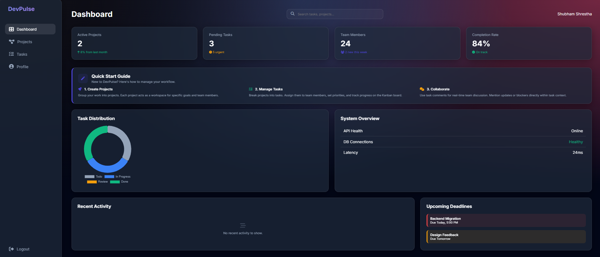
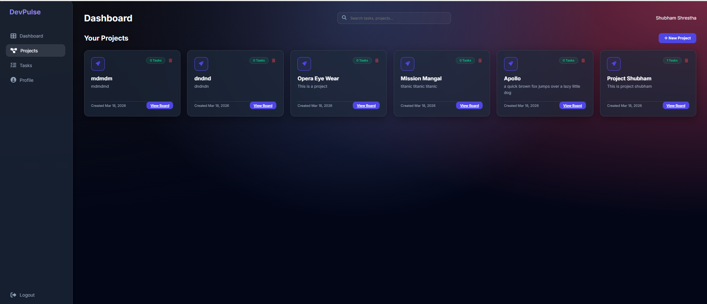
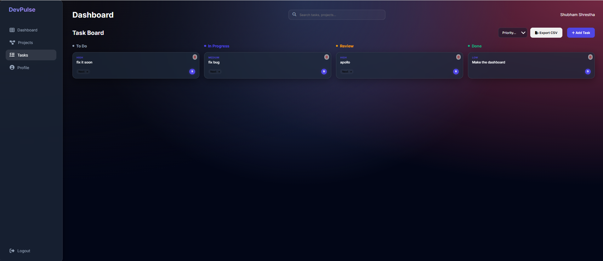
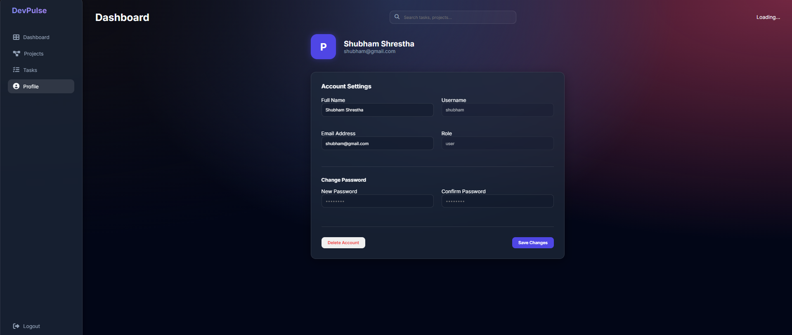
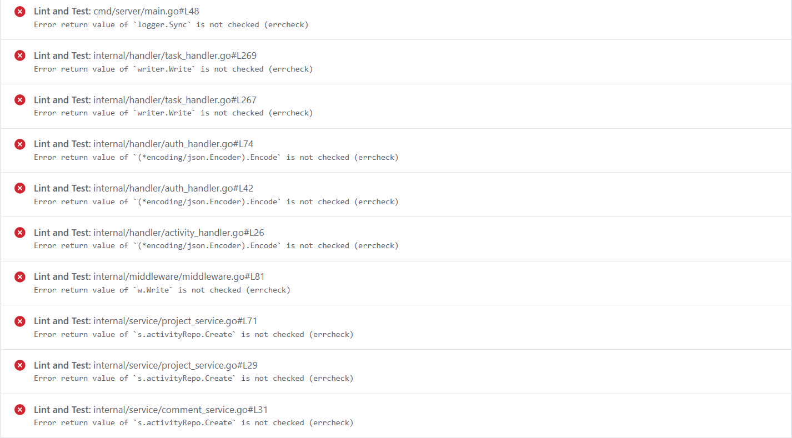

# DevPulse — Production-Grade Full-Stack Go & DevOps


**DevPulse** is a team productivity and project management platform built with idiomatic Go and modern DevOps principles. This project serves as a comprehensive playground for SRE and DevOps implementation practice.

## Features

- **Robust Backend**: Clean architecture with Repository pattern, JWT Auth, and Structured Logging.
- **Premium UI**: Glassmorphic dark-theme frontend using Go Templates, Vanilla CSS, and JS.
- **Persistent Storage**: PostgreSQL integration with automated migrations.
- **Observability**: Prometheus metrics and health checks ready for Grafana.
- **Cloud Native**: Multi-stage Docker builds and complete Kubernetes/Helm orchestration.
- **CI/CD**: GitHub Actions pipeline for automated testing and containerization.

## Tech Stack

- **Go 1.22** (Chi Router, pgx, zap, JWT, bcrypt)
- **PostgreSQL 16**
- **Docker & Docker Compose**
- **Kubernetes & Helm**
- **Prometheus & Grafana**

## Quick Start (Local Docker)

1. Clone the repository
2. Run the full stack:
   ```bash
   docker compose up -d
   ```
3. Access the application:
   - App: `http://localhost:8080`
   - Prometheus: `http://localhost:9090`
   - Grafana: `http://localhost:3000`

## DevOps Practice Guide

- **Docker**: Explore the multi-stage `Dockerfile` and `docker-compose.yml`.
- **Helm**: Deploy as a production package:
   ```bash
   helm install devpulse ./helm/charts/devpulse
   ```
- **Argo CD (GitOps)**: Automated deployments are managed via Argo CD. Apply the manifests:
   ```bash
   kubectl apply -f argocd/
   ```
   - **Argo CD UI**: `http://argocd.local`
   - **Default Credentials**: `admin` / Password retrieved via:
     `kubectl -n argocd get secret argocd-initial-admin-secret -o jsonpath="{.data.password}" | base64 -d`
- **Ingress**: Traefik is used for routing. Access via `devpulse.local` after adding to your hosts file.
- **Monitoring & Logging (LPL Stack)**:
   - **Prometheus/Grafana**: Metrics visualization.
   - **Loki/Promtail**: Lightweight log collection (integrated into Grafana).
     ```bash
     kubectl apply -f monitoring/prometheus/
     kubectl apply -f monitoring/grafana/
     kubectl apply -f monitoring/loki/
     kubectl apply -f monitoring/ingress.yaml
     ```
     - **Grafana**: `http://grafana.local`
     - **Prometheus**: `http://prometheus.local`
- **Scaling**: Test HPA by putting load on the `/api` endpoints.
- **Monitoring**: Check the `/metrics` endpoint and set up Grafana dashboards.

---
Built for production-grade DevOps practice.







