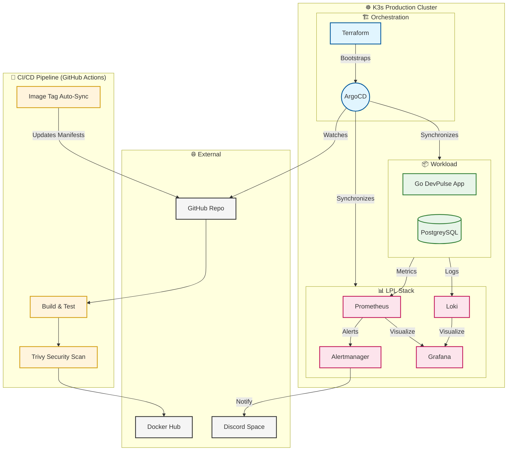

# DevPulse — Production-Grade Full-Stack Go & DevOps


**DevPulse** is a team productivity and project management platform built with idiomatic Go and modern DevOps principles. This project serves as a comprehensive playground for SRE and DevOps implementation practice.

## Features

- **Clean Architecture**: Idiomatic Go with Repository pattern and Service layer.
- **Visual Excellence**: Premium Glassmorphic UI with dynamic charts and recent activity feeds.
- **GitOps Orchestration**: Fully automated delivery via **ArgoCD** with self-healing.
- **Platforms as Code**: Infrastructure bootstrapped via **Terraform**.
- **Observability**: Complete **LPL stack** (Loki, Prometheus, Grafana) with Discord alerting.
- **Security First**: Multi-stage builds, Trivy vulnerability scanning, and RBAC-hardened monitoring.

## 🏗️ Technical Architecture



## 🛠️ Tech Stack

**Backend**: Go 1.22 (Chi, pgx, zap, JWT)  
**Database**: PostgreSQL 16 (StatefulSet)  
**Infrastructure**: Terraform, Kubernetes (k3s), Helm v3  
**Orchestration**: ArgoCD (GitOps)  
**Monitoring**: Prometheus, Alertmanager, Grafana, Loki, Promtail, Kube-State-Metrics  

## Quick Start (Local Docker)

1. Clone the repository
2. Run the full stack:
   ```bash
   docker compose up -d
   ```
3. Access the application:
   - App: `http://localhost:8080`
   - Prometheus: `http://localhost:9090`
   - Grafana: `http://localhost:3000`

## DevOps Practice Guide

- **Docker**: Explore the multi-stage `Dockerfile` and `docker-compose.yml`.
- **Helm**: Deploy as a production package:
   ```bash
   helm install devpulse ./helm/charts/devpulse
   ```
- **Argo CD (GitOps)**: Automated deployments are managed via Argo CD. Apply the manifests:
   ```bash
   kubectl apply -f argocd/
   ```
   - **Argo CD UI**: `http://argocd.local`
   - **Default Credentials**: `admin` / Password retrieved via:
     `kubectl -n argocd get secret argocd-initial-admin-secret -o jsonpath="{.data.password}" | base64 -d`
- **Ingress**: Traefik is used for routing. Access via `devpulse.local` after adding to your hosts file.
- **Monitoring & Logging (LPL Stack)**:
   - **Prometheus/Grafana**: Metrics visualization.
   - **Loki/Promtail**: Lightweight log collection (integrated into Grafana).
     ```bash
     kubectl apply -f monitoring/prometheus/
     kubectl apply -f monitoring/grafana/
     kubectl apply -f monitoring/loki/
     kubectl apply -f monitoring/ingress.yaml
     ```
     - **Grafana**: `http://grafana.local`
     - **Prometheus**: `http://prometheus.local`
- **Scaling**: Test HPA by putting load on the `/api` endpoints.
- **Monitoring**: Check the `/metrics` endpoint and set up Grafana dashboards.

---

## 🎙️ DevOps Presentation Guide

This section is for explaining the technical depth of this project during interviews or peer reviews.

- **Infrastructure as Code (IaC)**: Terraform bootstraps the cluster's base (ArgoCD & namespaces).
- **GitOps Methodology**: ArgoCD acts as the primary orchestrator, ensuring zero-drift between Git and the Cluster.
- **Observability Mastery**: A full LPL stack with active Discord alerting for both Pod failures and resource mismatches.
- **Hardened Pipeline**: CI/CD with security scanning (Trivy) and automated image tag synchronization.

---
Built for production-grade DevOps practice.


