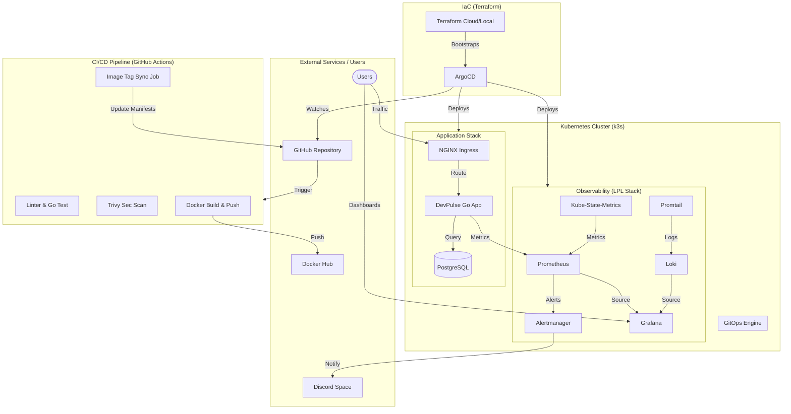

# 📊 DevOps Architecture & Interview Guide

This document provides a professional visualization of the DevPulse platform and "talking points" you can use to explain it in a DevOps or SRE interview.

## 🗺️ System Architecture Diagram

---

## 🎙️ How to explain this in an interview

"I built a production-grade developer platform focused on **GitOps** and **Observability**. Here’s how it works from the bottom up:"

### 1. The Infrastructure (IaC)
> "Instead of manual setup, I used **Terraform** as the orchestrator. It bootstraps the cluster by installing ArgoCD via Helm and defining the Application resources. This ensures the entire platform can be recreated from scratch in minutes."

### 2. The Delivery Pipeline (CI/CD)
> "I implemented a secure CI/CD pipeline in **GitHub Actions**. It’s not just a 'build and push' script—it includes **Trivy** for container vulnerability scanning and an automated **Image Tag Sync** job that updates the Helm manifests in Git, triggering a seamless ArgoCD rollout."

### 3. The Source of Truth (GitOps)
> "Everything in the cluster is managed by **ArgoCD**. Continuous synchronization and **Self-Healing** are enabled, meaning if a resource is manually deleted or modified, ArgoCD will immediately revert it to the desired state defined in Git."

### 4. The Observability Stack (LPL)
> "I deployed a full **LPL stack** (Loki, Prometheus, Grafana). To make the monitoring 'active', I integrated **Alertmanager** with custom alerting rules for both application performance and Kubernetes infrastructure health (via **kube-state-metrics**), with notifications routed to **Discord**."

### 5. The Application Code
> "The core is an idiomatic **Go** web application using a Repository pattern for PostgreSQL. It includes a custom **Glassmorphic UI** and exports its own Prometheus metrics, making it a first-class citizen in the monitoring stack."
